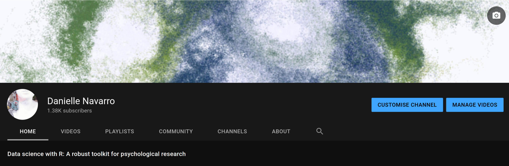

<!-- Note: At the outset, do a find/replace on "SLIDES-NAME" -->

```{r child = "style/slide-setup.Rmd"}
```

```{r load-packages, message=FALSE, echo=FALSE}
library(tidyverse)
library(flair)
library(metathis)
```


```{r meta, echo=FALSE}
meta() %>%
  meta_general(
    description = "An idiosyncratic journey from mathematical psychology to data science",
  ) %>% 
  meta_name("github-repo" = "djnavarro/slides") %>% 
  meta_social(
    title = "!!meaningful_title",
    url = "https://djnavarro.net/slides-shaping-ds-future",
    image = "https://slides.djnavarro.net/slides-shaping-ds-future/img/twitter-image.png",
    image_alt = "",
    og_type = "website",
    og_author = "Danielle Navarro",
    twitter_card_type = "summary_large_image",
    twitter_creator = "@djnavarro"
  )
```


```{r echo=FALSE, results='asis'}
cat(create_unnumbered_section(
  title = " > <br> > <br> > gh::gh_whoami() ", 
  shade = "#ffffff",
  image = "img/watercolour_sys01_img31_seed4.png"
))
```


<!----------------------------- SLIDE BREAK ----------------------------->
---

class: inverse, middle

<a href="https://djnavarro.net">

</a>
https://djnavarro.net

<!----------------------------- SLIDE BREAK ----------------------------->
---


class: middle, inverse

<p align="center"></p>

---


```{r echo=FALSE, results='asis'}
cat(create_unnumbered_section(
  title = " > <br> > <br> > psych::outlier()", 
  shade = "#ffffff",
  image = "img/watercolour_sys01_img34_seed4.png"
))
```


---


background-image: url("img/fakurian-design-58Z17lnVS4U-unsplash.jpg")
background-size: cover

.hand[.large[The mind as a probabilistic learning machine]]


---

class: middle, inverse

<iframe src="https://djnavarro.net/papers/2017_noneoftheabove.pdf" width="100%" height="100%"></iframe>


---

class: middle

<p align="center"></p>


---

class: middle

<p align="center"></p>


---

class: middle

<p align="center"></p>


---

class: middle, inverse

<iframe src="https://djnavarro.net/papers/2009_firstpassage.pdf" width="100%" height="100%"></iframe>


---

class: middle

<p align="center"></p>


---

class: middle, inverse

<iframe src="https://djnavarro.net/papers/2019_swow.pdf" width="100%" height="100%"></iframe>


---

class: middle

<iframe src="https://smallworldofwords.org/en/project/visualize" width="100%" height="100%"></iframe>


<!----------------------------- SLIDE BREAK ----------------------------->
---


```{r echo=FALSE, results='asis'}
cat(create_unnumbered_section(
  title = " > <br> > <br> > stats::effects()", 
  shade = "#ffffff",
  image = "img/watercolour_sys01_img39_seed4.png"
))
```


---


background-image: url("img/christopher-sardegna-CMOa3H1SXG0-unsplash.jpg")
background-size: cover

.hand[.large[What problem are we solving?]]


---

class: middle, inverse

<iframe src="https://djnavarro.net/papers/2019_devildeepbluesea.pdf" width="100%" height="100%"></iframe>


---

class: middle, inverse

<iframe src="https://djnavarro.net/papers/2021_formalopenscience.pdf" width="100%" height="100%"></iframe>

  


---

class: middle, inverse

<iframe src="https://djnavarro.net/papers/preprint_shepard.pdf" width="100%" height="100%"></iframe>

  


---

class: middle, inverse

.large[.embolden[Estimating the future performance of a model with regards to data collected via unknowable experiments is likely impossible]]

<span style="color:#666">Navarro, 2019</span>

---

class: middle, inverse


.large[.embolden[Our theoretical models are defined with respect to simplified 'toy worlds'; humans, however, must occupy the real one]]

<span style="color:#666">Navarro, 2021</span>


<!----------------------------- SLIDE BREAK ----------------------------->
---


```{r echo=FALSE, results='asis'}
cat(create_unnumbered_section(
  title = " > <br> > <br> > devtools::build()", 
  shade = "#ffffff",
  image = "img/watercolour_sys01_img33_seed4.png"
))
```


---

class: middle

<p align="center"></p>


---


background-image: url("img/julie-molliver-Z3vFp7szCAY-unsplash.jpg")
background-size: cover

.hand[.large[Making the tools accessible and friendly]]


---

class: middle, inverse


.large[.embolden[Art can be a welcoming bridge for learners and users to engage with and learn tools and skills in R. As RStudio’s first Artist-in-Residence, my goal has been to make the R landscape more welcoming for a broader community of users through engaging, didactic artwork]]

Allison Horst, [rstudio::conf talk](https://www.rstudio.com/resources/rstudioglobal-2021/art-lessons-one-year-as-rstudios-artist-in-residence/)


---

class: middle, inverse

<iframe src="https://learningstatisticswithr.com" width="100%" height="100%"></iframe>


---

class: middle, inverse

<iframe src="https://slides.djnavarro.net" width="100%" height="100%"></iframe>


---

class: middle, inverse

<a href="https://youtube. djnavarro.net">

</a>
https://youtube.djnavarro.net


---

class: middle, inverse

<iframe src="https://blog.djnavarro.net/posts/pretty-little-clis/" width="100%" height="100%"></iframe>


---


class: middle, inverse
<a href="https://art.djnavarro.net">

</a>
https://art.djnavarro.net


---

class: middle, inverse

.large[.embolden[Cute and credible can coexist]]

Allison Horst, [rstudio::conf talk](https://www.rstudio.com/resources/rstudioglobal-2021/art-lessons-one-year-as-rstudios-artist-in-residence/)


<!----------------------------- SLIDE BREAK ----------------------------->
---


```{r echo=FALSE, results='asis'}
cat(create_unnumbered_section(
  title = " > <br> > <br> > thank you for listening! <br> > @djnavarro",
  shade = "#ffffff",
  image = "img/watercolour_sys01_img41_seed4.png"
))
```


